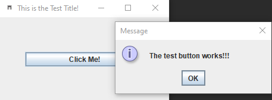

<!-- HEADER -->
<h4 align="center">Simple cross platform project template using Gradle.</h4>

<!-- SHIELDS -->

  
  

<!-- LINKS -->

  <a href="#features">Features</a> •
  <a href="#how-to-use">How To Use</a> •
  <a href="#contributing">Contributing</a>

<!-- SCREENSHOT -->
<h4 align="center">
   
    
   
    Screenshot of the supplied test GUI
   
</h4>

## Features

  * Gradle project to build cross platform apps
  
## How To Use

  It is recommended you import the project into an IDE such as IntelliJ and build it in there.

## Contributing

  For now if you would like to contribute check out any currently open [issues](https://github.com/dadler64/GradleAppTemplate/issues) which could be resolved.
